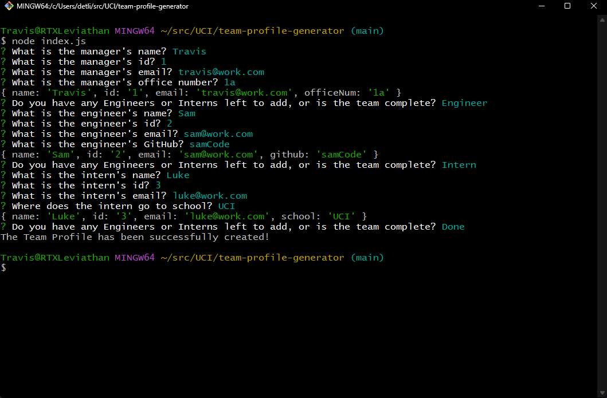
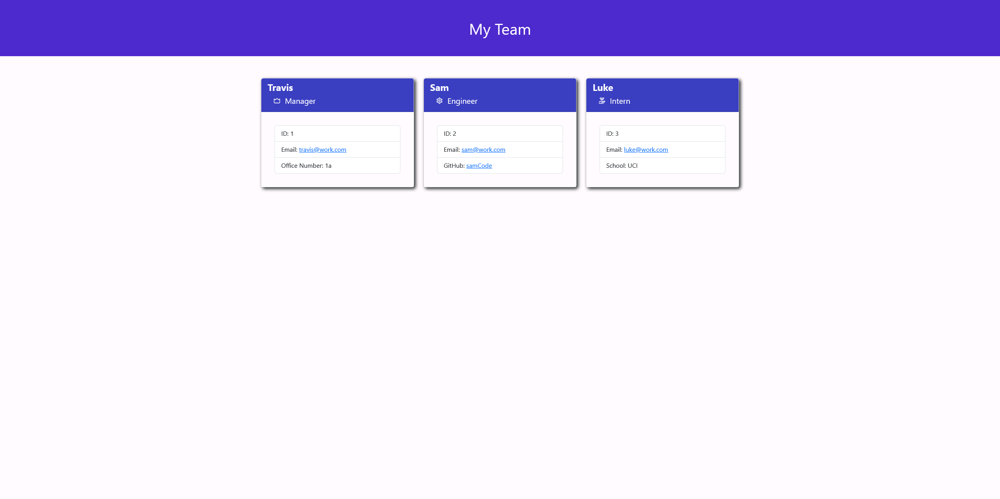

# Team Profile Generator

## Description

This application can be used by employers a software engineering team to quickly record relevant information about their employees.

Using inquirer, the user is prompted for information about the manager and any engineers or interns that may report to them. When the user is finished adding team members to the profile, the application will quit and an index.html file that is populated with the received data will be generated.

## Table of Contents

- [Team Profile Generator](#team-profile-generator)
  - [Description](#description)
  - [Table of Contents](#table-of-contents)
  - [Installation](#installation)
  - [Usage](#usage)
  - [License](#license)
  - [Questions](#questions)

## Installation

This application is dependent on the Inquirer npm module to run. Before use, the user should run the command [npm i]/[npm install] in their terminal to allow the program to install dependencies. This will also install the Jest npm module that can be used for testing.

## Usage

In order to use this application, after having installed the necessary dependencies, the user should start by typing the command [node index.js] in their command terminal/console. When the command is entered properly, the user will be presented with a series of questions about the members of their team. the user will be prompted for each employees' Name, ID, and Email, but they will also be required to respond to a question depending on what role the new member has.

After the prompts for the new employee have been completed, the user will be asked again if they would either like to add a new engineer or intern or if they are done with the team profile. An example of this process in use is shown below

If the user selects "done", the process will terminate and a new index.html file will be created in the "dist" folder. The index.html will feature cards for each of the employees generated by the application as shown below

Running the application a second time will result in the first index.html file being overwritten. In order to save the team profile, either rename the index.html file or move it out of the "dist" folder.

An example video of this process can be viewed [here](https://drive.google.com/file/d/1V2cjk2ryw_pMxqDMBtTPQRKfGeI_z_YT/view?usp=sharing)

## License

    MIT License

    Copyright (c) 2023 Travis Miller

    Permission is hereby granted, free of charge, to any person obtaining a copy of this software and associated documentation files (the "Software"), to deal in the Software without restriction, including without limitation the rights to use, copy, modify, merge, publish, distribute, sublicense, and/or sell copies of the Software, and to permit persons to whom the Software is furnished to do so, subject to the following conditions:

    The above copyright notice and this permission notice shall be included in all copies or substantial portions of the Software.

    THE SOFTWARE IS PROVIDED "AS IS", WITHOUT WARRANTY OF ANY KIND, EXPRESS OR IMPLIED, INCLUDING BUT NOT LIMITED TO THE WARRANTIES OF MERCHANTABILITY, FITNESS FOR A PARTICULAR PURPOSE AND NONINFRINGEMENT. IN NO EVENT SHALL THE AUTHORS OR COPYRIGHT HOLDERS BE LIABLE FOR ANY CLAIM, DAMAGES OR OTHER LIABILITY, WHETHER IN AN ACTION OF CONTRACT, TORT OR OTHERWISE, ARISING FROM, OUT OF OR IN CONNECTION WITH THE SOFTWARE OR THE USE OR OTHER DEALINGS IN THE SOFTWARE.

## Questions

If you have any questions, comments, or concerns, contact the developer using the email provided below

Email: [traviscmiller01@gmail.com](mailto:traviscmiller01@gmail.com);

Check out the developer's other projects on GitHub by cicking the link below

GitHub Username: [tcmiller30](https://github.com/tcmiller30)
